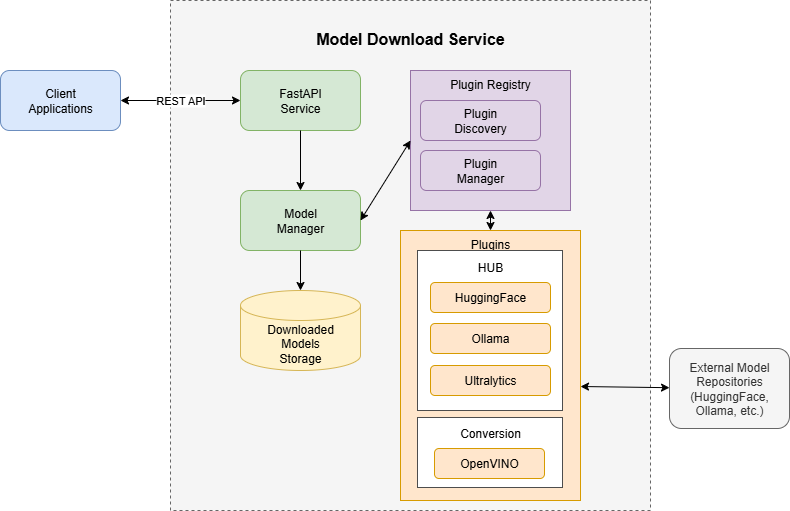

## Model Download

The Model Download Microservice provides a unified solution for downloading AI/ML models from various model hubs while ensuring consistency and simplicity across applications. This service acts as a centralized model management system that handles model downloads, storage, and optional format conversions.

## Architecture

The diagram below illustrates the high-level architecture of the Model Download Microservice, showcasing its core components and their interactions with external systems.

    

## Components

The service follows a plugin-based microservice architecture with the following key components:

### Core Components

1. **FastAPI Service Layer**
   - **Description**: The FastAPI Service Layer serves as the primary entry point for all client interactions. It exposes a RESTful API for downloading, converting, and managing models.
   - **Responsibilities**:
     - Provides RESTful API endpoints for all service operations.
     - Handles incoming request validation, serialization, and routing to the appropriate components.
     - Generates and serves OpenAPI (Swagger) documentation for clear, interactive API specifications.

2. **Model Manager**
   - **Description**: The Model Manager is the central orchestration component that directs the model download and conversion processes. It acts as the brain of the service, coordinating actions between the API layer and the plugin system.
   - **Responsibilities**:
     - Orchestrates end-to-end model download and conversion workflows.
     - Manages model storage, including organizing file paths and handling caching.
     - Interfaces with the Plugin Registry to delegate tasks to the appropriate plugins.

3. **Plugin Registry**
   - **Description**: The Plugin Registry is responsible for the discovery, registration, and management of all available plugins. It provides a flexible mechanism for extending the service's capabilities without modifying the core application logic.
   - **Responsibilities**:
     - Dynamically discovers and registers plugins at startup.
     - Manages the lifecycle of each plugin.
     - Provides a consistent abstraction layer that decouples the Model Manager from concrete plugin implementations.

### Plugin System

The service's functionality is extended through a modular plugin system that handles interactions with different model sources and conversion tasks.

**Model Hub Plugins:**
- **HuggingFace Hub Plugin**: Manages model downloads from the Hugging Face Hub, including handling authentication for private or gated models.
- **Ollama Hub Plugin**: Interfaces with Ollama to pull and manage models from the Ollama model library.
- **Ultralytics Hub Plugin**: Downloads computer vision models, such as YOLO, from the Ultralytics framework.

**Conversion Plugins:**
- **OpenVINO Model Conversion Plugin**: Provides functionality to convert downloaded models (e.g., from Hugging Face) into the OpenVINO™ Intermediate Representation (IR) format for optimized inference on Intel hardware.

### Storage

- **Downloaded Models Storage**: This component represents the physical storage location for all downloaded and converted models. It is a configurable file system path that acts as a centralized repository and cache.
  - **Responsibilities**:
    - Provides a persistent location for storing model files.
    - Enables caching to avoid redundant downloads of the same model.
    - Organizes models in a structured directory format for easy access.

## Key Features

- **Multi-Hub Support**: Download models from multiple sources (HuggingFace, Ollama, Ultralytics)
- **Format Conversion**: Convert models to OpenVINO format for optimization
- **Parallel Downloads**: Optional concurrent model downloads
- **Precision Control**: Support for various model precisions (INT8, FP16, FP32)
- **Device Targeting**: Optimization for different compute devices (CPU, GPU)
- **Caching**: Configurable model caching for improved performance

## Integration

The service can be integrated into applications through:
- REST API calls
- Docker container deployment
- Docker Compose orchestration

## Use Cases

This microservice is ideal for:
- Edge AI applications requiring model downloads
- Development and testing environments
- Sample applications demonstrating AI capabilities
- Automated model deployment pipelines

## Limitations

This service is not intended to replace full model registry solutions and has the following limitations:
- Basic model versioning
- Limited model metadata management
- No built-in model serving capabilities

## Supporting Resources
- [**Get Started Guide**](./get-started.md)
- [**API Reference**](./api-docs/openapi.yaml)