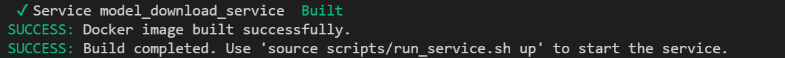

# How to Build from Source

This guide provides step-by-step instructions for building the Model Download Microservice from source.

## Prerequisites

Before you begin, ensure that you have the following prerequisites:
- Docker installed on your system: [Installation Guide](https://docs.docker.com/get-docker/).

## Steps to Build from Source
1. **Clone the Repository**:
    - Clone the model-download repository:
      ```bash
      # Clone the latest on mainline
        git clone https://github.com/open-edge-platform/edge-ai-libraries.git edge-ai-libraries
      # Alternatively, Clone a specific release branch
        git clone https://github.com/open-edge-platform/edge-ai-libraries.git edge-ai-libraries -b <release-tag>
      ```
2. **Navigate to the directory**:
    - Go to the model-download microservice directory
      ```bash
      cd microservices/model-download
      ```
3. **Configure the environment variables**
    - Set the below environment variable
      ```bash
      export HUGGINGFACEHUB_API_TOKEN=<your huggingface token>
      ```
4. **Build the docker image**
    - Build the Docker image for the Model Download Microservice:
      ```bash
      source scripts/run_service.sh --build
      ``` 
      - Once the service is built as shown in the below screenshot.
    
    **Examples**
      - Force rebuild from scratch (no cache): `source scripts/run_service.sh --rebuild`
      - Display usage information: `source scripts/run_service.sh --help`
      
5. **Run the Docker Container**: 
    - Run the Docker container using the built image:
      ```bash
        source scripts/run_service.sh up --plugins all --model-path tmp/models
      ```
    __Note__: The above will bring up the service and install the dependencies for all the available plugins. For more details of the options available refer [here](./get-started.md#options-available-with-the-script)

6.  **Access the Application**:
    - Open a browser and go to `http://<host-ip>:8200/api/v1/docs` to access the OpenApi spec documentation for the application.

## Verification

- Ensure that the application is running by checking the Docker container status:
  ```bash
  docker ps
  ```
- Access the application dashboard and verify that it is functioning as expected.

## Troubleshooting

- If you encounter any issues during the build or run process, check the Docker logs for errors:
  ```bash
  docker logs <container-id>
  ```