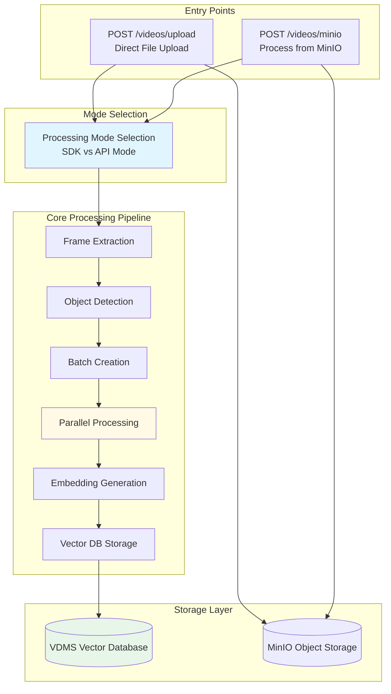
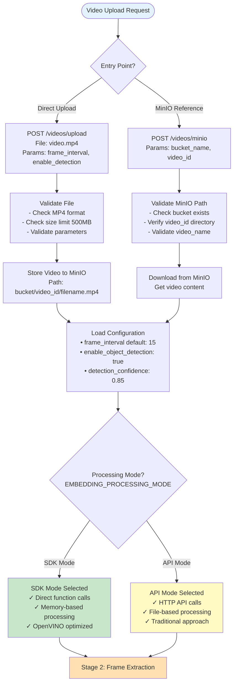
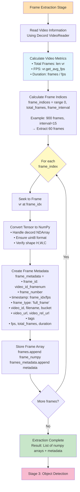
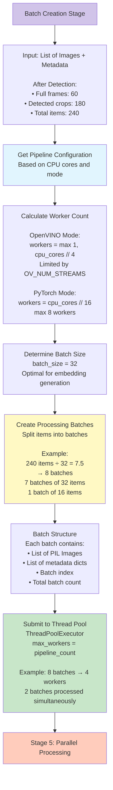
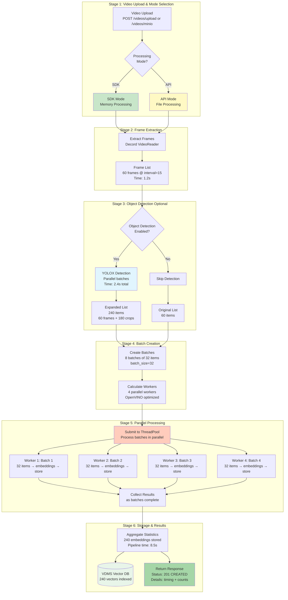
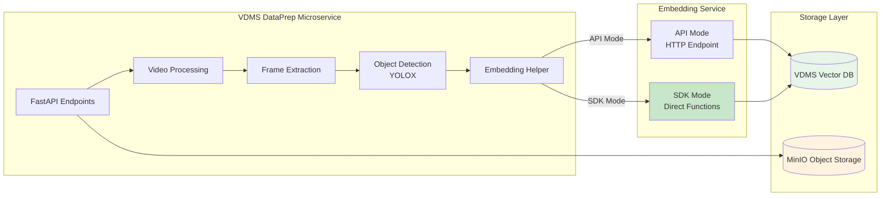

# Video Ingestion Flow: From Upload to Vector Database Storage

## Overview

This document provides a comprehensive visual flow of the video ingestion process in the VDMS DataPrep microservice, from initial upload through frame extraction, embedding generation, and final storage in the vector database. The process has been optimized for performance with parallel processing, batch operations, and support for both API and SDK embedding modes.

---

## High-Level Architecture



---

## Detailed Video Ingestion Flow

### Stage 1: Video Upload & Initial Processing



**Key Decisions:**
- **Entry Point Selection**: Direct upload saves to MinIO first; MinIO processing retrieves from existing storage
- **Mode Selection**: SDK mode (optimized) vs API mode (traditional HTTP calls)
- **Configuration Priority**: Request params → Config file defaults → Service defaults

**Performance Factors:**
- File validation is minimal overhead (~ms)
- MinIO upload/download depends on video size and network
- SDK mode eliminates network latency for embeddings

---

### Stage 2: Frame Extraction & Metadata Creation



**Optimization Highlights:**
1. **Decord Library**: GPU-capable video reading (though currently using CPU context for reliability)
2. **Memory Efficiency**: Frames stored as numpy arrays, not written to disk in SDK mode
3. **Metadata Richness**: Comprehensive frame metadata for search/retrieval

**Performance Metrics:**
- **Frame Extraction Time**: Typically 0.5-2s for 60 frames from 30s video
- **Memory Usage**: ~4MB per 1080p frame (uncompressed)
- **Extraction Rate**: ~30-100 frames/second depending on video resolution

---

### Stage 3: Object Detection (Optional)

```mermaid
flowchart TD
    START[Object Detection Stage] --> CHECK{Object Detection<br/>Enabled?}
    
    CHECK -->|Disabled| SKIP[Skip Detection<br/>Use full frames only<br/>frames remain unchanged]
    CHECK -->|Enabled| INIT[Initialize YOLOX Detector<br/>• Model: yolox_s<br/>• Device: CPU/GPU<br/>• Confidence: 0.85<br/>• Input Size: 640x640<br/>• NMS Threshold: 0.45]
    
    INIT --> BATCH_DETECT[Create Detection Batches<br/>detection_batch_size = 32<br/><br/>Example: 60 frames → 2 batches]
    
    BATCH_DETECT --> PARALLEL_DETECT{Process Batches<br/>in Parallel}
    
    PARALLEL_DETECT --> BATCH_PROC[For Each Batch]
    
    BATCH_PROC --> FRAME_LOOP{For each frame<br/>in batch}
    
    FRAME_LOOP --> CONVERT_PIL[Convert Frame to PIL<br/>Image.fromarray frame_numpy]
    
    CONVERT_PIL --> DETECT[Run YOLOX Detection<br/>detector.detect frame_pil]
    
    DETECT --> ADD_FULL[Add Full Frame<br/>frame_type: full_frame<br/>Keep original frame metadata]
    
    ADD_FULL --> CROPS{Detections<br/>Found?}
    
    CROPS -->|Yes| CROP_LOOP{For each<br/>detection}
    
    CROP_LOOP --> EXTRACT_CROP[Extract Crop<br/>• Validate bbox coordinates<br/>• Crop: frame y1:y2, x1:x2<br/>• Convert to PIL Image<br/>• Min size: 10x10 pixels]
    
    EXTRACT_CROP --> CROP_META[Create Crop Metadata<br/>crop_metadata = frame_metadata + <br/>• frame_type: detected_crop<br/>• is_detected_crop: true<br/>• crop_index<br/>• detection_confidence<br/>• crop_bbox x1 y1 x2 y2<br/>• detected_class_id<br/>• detected_label]
    
    CROP_META --> ADD_CROP[Add Crop to Results<br/>all_images.append crop_pil<br/>all_metadata.append crop_meta]
    
    ADD_CROP --> MORE_CROPS{More crops?}
    MORE_CROPS -->|Yes| CROP_LOOP
    MORE_CROPS -->|No| MORE_FRAMES
    
    CROPS -->|No| MORE_FRAMES{More frames?}
    
    MORE_FRAMES -->|Yes| FRAME_LOOP
    MORE_FRAMES -->|No| BATCH_DONE[Batch Complete]
    
    BATCH_DONE --> MORE_BATCHES{More batches?}
    MORE_BATCHES -->|Yes| PARALLEL_DETECT
    MORE_BATCHES -->|No| DETECTION_DONE[Detection Complete<br/><br/>Example Expansion:<br/>60 frames → 240 items<br/>60 full frames + 180 crops<br/>avg 3 objects/frame]
    
    SKIP --> BATCH_CREATE
    DETECTION_DONE --> BATCH_CREATE[Stage 4: Batch Creation]
    
    style START fill:#f8bbd0
    style INIT fill:#e1f5fe
    style PARALLEL_DETECT fill:#fff9c4
    style DETECTION_DONE fill:#c8e6c9
    style BATCH_CREATE fill:#d1c4e9
```



**Object Detection Details:**

**Model Specifications:**
- **Architecture**: YOLOX-S (small variant)
- **Framework**: OpenVINO IR format
- **Input Resolution**: 640x640 (preprocessed)
- **Classes**: 80 COCO categories (person, car, bicycle, etc.)
- **Download**: Auto-downloaded from GitHub on first use

**Detection Process:**
1. **Preprocessing**: Image resized to 640x640, normalized
2. **Inference**: OpenVINO execution on CPU/GPU
3. **Postprocessing**: NMS filtering with threshold 0.45
4. **Crop Extraction**: Bounding boxes validated and extracted

**Performance Characteristics:**
- **Detection Speed**: ~50-100ms per frame (CPU), ~10-20ms (GPU)
- **Parallel Batches**: 2-4 detection workers typical
- **Expansion Factor**: 1.5x to 5x (avg 3 objects/frame)
- **Memory Impact**: +20-50% for crop storage

**Optimization Strategy:**
- Batched detection reduces overhead
- Parallel processing utilizes multi-core CPUs
- Global detector instance reused (no reload per request)
- Crops validated (min 10x10px, valid coordinates)

---

### Stage 4: Batch Creation for Parallel Processing



**Pipeline Configuration Logic:**

```python
# Pseudo-code for worker calculation
cpu_cores = multiprocessing.cpu_count()

if use_openvino:
    base_workers = max(1, cpu_cores // 4)
    
    # Check OpenVINO environment variables
    ov_limit = check_env_vars([
        'OV_PERFORMANCE_HINT_NUM_REQUESTS',
        'PERFORMANCE_HINT_NUM_REQUESTS', 
        'OV_NUM_STREAMS'
    ])
    
    if ov_limit:
        workers = min(base_workers, ov_limit)
    else:
        workers = base_workers
else:
    # PyTorch is more CPU-intensive
    workers = min(max(1, cpu_cores // 16), 8)

batch_size = 32  # Fixed optimal size
```

**Configuration Examples:**

| CPU Cores | OpenVINO Mode | PyTorch Mode |
|-----------|---------------|--------------|
| 8 cores   | 2 workers     | 1 worker     |
| 16 cores  | 4 workers     | 1 worker     |
| 32 cores  | 8 workers     | 2 workers    |
| 64 cores  | 16 workers    | 4 workers    |
| 96 cores  | 24 workers    | 6 workers    |

**Batch Size Considerations:**
- **32 items per batch**: Optimal balance for embedding models
- **Smaller batches**: Lower memory, higher overhead
- **Larger batches**: Higher memory, better throughput
- **Dynamic adjustment**: Future enhancement based on available memory

---

### Stage 5: Parallel Batch Processing Pipeline

```mermaid
flowchart TD
    START[Parallel Processing Stage] --> POOL[Thread Pool Executor<br/>max_workers = pipeline_count<br/><br/>Example: 4 workers<br/>Processing 8 batches]
    
    POOL --> SUBMIT_ALL[Submit All Batches<br/>All batches queued<br/>Workers pick up jobs dynamically]
    
    SUBMIT_ALL --> WORKER1[Worker 1<br/>Process Batch]
    SUBMIT_ALL --> WORKER2[Worker 2<br/>Process Batch]
    SUBMIT_ALL --> WORKER3[Worker 3<br/>Process Batch]
    SUBMIT_ALL --> WORKER4[Worker 4<br/>Process Batch]
    
    WORKER1 --> BATCH_PROC1[Single Batch Processing]
    WORKER2 --> BATCH_PROC1
    WORKER3 --> BATCH_PROC1
    WORKER4 --> BATCH_PROC1
    
    subgraph "Single Batch Processing Pipeline"
        BATCH_PROC1[Start Batch Processing<br/>Input: 32 images + metadata]
        
        BATCH_PROC1 --> STEP1[Step 1: Validation<br/>Check model supports images<br/>Skip if text-only model]
        
        STEP1 --> STEP2[Step 2: Generate Embeddings<br/>SDK Mode: Direct function call<br/>API Mode: HTTP POST request]
        
        STEP2 --> EMB_DETAIL[Embedding Generation Details]
        
        subgraph "Embedding Generation"
            EMB_DETAIL --> EMB_SDK{Mode?}
            
            EMB_SDK -->|SDK| EMB_SDK_PROC[SDK Embedding<br/>• Use global SDK client<br/>• Thread-safe infer_new_request<br/>• No HTTP overhead<br/>• OpenVINO optimized<br/>• Batch processing inside model]
            
            EMB_SDK -->|API| EMB_API_PROC[API Embedding<br/>• HTTP POST to embedding service<br/>• Serialize images to base64<br/>• Network latency<br/>• JSON response parsing<br/>• Model runs remotely]
            
            EMB_SDK_PROC --> EMB_RESULT[Embedding Results<br/>Vector dimensions: 512/768/1024<br/>Format: List of float arrays]
            EMB_API_PROC --> EMB_RESULT
        end
        
        EMB_RESULT --> STEP3[Step 3: Validate Embeddings<br/>Filter out null/failed embeddings<br/>Match embeddings to metadata]
        
        STEP3 --> STEP4[Step 4: Store to Vector DB<br/>Immediate batch storage<br/>Prevents OutOfJournalSpace]
        
        STEP4 --> STORAGE_DETAIL[VDMS Storage Details]
    end
    
    subgraph "VDMS Vector DB Storage"
        STORAGE_DETAIL --> VDB_PREP[Prepare Storage Request<br/>• Embeddings: List of vectors<br/>• Metadata: List of dicts<br/>• Collection: DB_COLLECTION]
        
        VDB_PREP --> VDB_BULK[Bulk Insert Operation<br/>AddEntity with AddDescriptor<br/>Batch operation more efficient]
        
        VDB_BULK --> VDB_INDEX[Vector Index Update<br/>VDMS updates HNSW index<br/>Enables similarity search]
        
        VDB_INDEX --> VDB_RETURN[Return Stored IDs<br/>List of entity IDs<br/>Used for verification]
    end
    
    VDB_RETURN --> BATCH_DONE[Batch Complete<br/>Return results:<br/>• embeddings_count<br/>• stored_ids<br/>• processing_time<br/>• detection_time<br/>• embedding_time<br/>• storage_time]
    
    BATCH_DONE --> COLLECTOR[Results Collector<br/>as_completed future]
    
    COLLECTOR --> MORE{More batches<br/>pending?}
    
    MORE -->|Yes| COLLECTOR
    MORE -->|No| AGGREGATE[Aggregate All Results<br/>Sum embeddings<br/>Combine stored_ids<br/>Calculate statistics]
    
    AGGREGATE --> FINAL[Stage 6: Final Results]
    
    style START fill:#ffccbc
    style EMB_SDK_PROC fill:#c8e6c9
    style EMB_API_PROC fill:#fff9c4
    style VDB_BULK fill:#e8eaf6
    style BATCH_DONE fill:#c8e6c9
```



**Parallel Processing Characteristics:**

**Thread Pool Execution:**
- **Dynamic Work Distribution**: Batches processed as workers become available
- **True Parallelism**: Multiple batches processed simultaneously
- **Completion Order**: Batches complete in any order (not sequential)
- **Timeout Protection**: 300s per batch maximum

**Embedding Generation Comparison:**

| Aspect | SDK Mode | API Mode |
|--------|----------|----------|
| **Method** | Direct function call | HTTP POST request |
| **Network** | None (in-process) | HTTP overhead |
| **Serialization** | None (PIL objects) | Base64 encoding |
| **Latency** | ~50-200ms/batch | ~200-800ms/batch |
| **Throughput** | Higher | Lower |
| **Memory** | Shared with service | Separate processes |
| **Optimization** | OpenVINO compiled | Model-dependent |

**Vector DB Storage Strategy:**

**Why Immediate Batch Storage:**
- **Prevents Memory Overflow**: Storing after each batch prevents accumulation
- **Protects Against Failures**: Partial results saved even if pipeline fails
- **Avoids VDMS Issues**: Prevents OutOfJournalSpace errors
- **Progress Tracking**: Stored IDs returned incrementally

**Bulk Insert Benefits:**
- **Reduced Overhead**: Single VDMS transaction per batch
- **Index Efficiency**: VDMS can optimize index updates
- **Faster Than Individual**: ~10x faster than per-item inserts

---

### Stage 6: Results Aggregation & Performance Metrics

```mermaid
flowchart TD
    START[Results Aggregation] --> COLLECT[Collect All Batch Results<br/>From ThreadPoolExecutor.as_completed]
    
    COLLECT --> AGGREGATE[Aggregate Statistics]
    
    subgraph "Statistics Calculation"
        AGGREGATE --> COUNT[Total Embeddings<br/>Sum all batch counts<br/><br/>Example: 8 batches<br/>7×32 + 1×16 = 240 embeddings]
        
        COUNT --> IDS[Stored IDs<br/>Concatenate all ID lists<br/>Verify no duplicates]
        
        IDS --> TIMES[Processing Times<br/>Calculate per-stage statistics]
        
        TIMES --> TIME_DETAIL[Time Breakdown]
        
        subgraph "Time Statistics"
            TIME_DETAIL --> EXTRACT_TIME[Frame Extraction<br/>Total time: e.g., 1.2s<br/>Frames extracted: 60]
            
            EXTRACT_TIME --> DETECT_TIME[Object Detection<br/>Avg per batch: e.g., 0.8s<br/>Max per batch: e.g., 1.2s<br/>% of batch time: e.g., 25%]
            
            DETECT_TIME --> EMBED_TIME[Embedding Generation<br/>Avg per batch: e.g., 2.1s<br/>Max per batch: e.g., 3.5s<br/>% of batch time: e.g., 65%]
            
            EMBED_TIME --> STORE_TIME[Vector DB Storage<br/>Avg per batch: e.g., 0.3s<br/>Max per batch: e.g., 0.5s<br/>% of batch time: e.g., 10%]
            
            STORE_TIME --> TOTAL_TIME[Total Pipeline Time<br/>Wall clock time: e.g., 8.5s<br/>Sequential would be: ~28s<br/>Speedup: 3.3x]
        end
    end
    
    TIME_DETAIL --> FRAME_COUNTS[Frame Count Summary]
    
    subgraph "Frame Flow Tracking"
        FRAME_COUNTS --> INPUT_FRAMES[Input Frames<br/>Extracted from video: 60]
        
        INPUT_FRAMES --> POST_DETECT[Post-Detection Items<br/>After object detection: 240<br/>Expansion: 4x]
        
        POST_DETECT --> STORED_EMBS[Stored Embeddings<br/>Successfully stored: 240<br/>Success rate: 100%]
    end
    
    STORED_EMBS --> BATCH_STATS[Batch Statistics]
    
    subgraph "Batch Performance"
        BATCH_STATS --> BATCH_COUNT[Batches Processed<br/>Total: 8 batches]
        
        BATCH_COUNT --> AVG_BATCH[Average Batch Time<br/>e.g., 3.5s per batch]
        
        AVG_BATCH --> MAX_BATCH[Max Batch Time<br/>e.g., 4.2s slowest batch]
        
        MAX_BATCH --> EFFICIENCY[Processing Efficiency<br/>Parallel overhead: ~15%<br/>Resource utilization: 85%]
    end
    
    EFFICIENCY --> RETURN_RESULT[Return Final Result]
    
    subgraph "API Response"
        RETURN_RESULT --> RESPONSE[HTTP Response<br/>Status: 201 CREATED<br/>Message: Embeddings created successfully]
        
        RESPONSE --> RESPONSE_BODY[Response Body Example]
        
        RESPONSE_BODY --> JSON[JSON Response:<br/>status: success<br/>message: Embeddings created<br/>total_embeddings: 240<br/>total_frames_processed: 60<br/>frame_interval: 15<br/>processing_mode: sdk_pipeline<br/>timing: extraction, parallel, storage<br/>frame_counts: extracted, detected, stored]
    end
    
    JSON --> COMPLETE([Processing Complete])
    
    style START fill:#e1bee7
    style COLLECT fill:#e1f5fe
    style TIME_DETAIL fill:#fff9c4
    style FRAME_COUNTS fill:#c8e6c9
    style BATCH_STATS fill:#ffccbc
    style COMPLETE fill:#a5d6a7
```



**Performance Metrics Explained:**

**Time Statistics:**

1. **Frame Extraction Time**: Time to read video and extract frames
   - Depends on: Video size, resolution, codec, storage speed
   - Typical: 0.5-3s for 60 frames

2. **Detection Time per Batch**: Time for object detection per batch
   - Depends on: Frame resolution, object count, CPU/GPU speed
   - Typical: 0.5-2s per batch of 32 items

3. **Embedding Time per Batch**: Time to generate embeddings
   - Depends on: Model size, device, batch size
   - Typical SDK: 1-3s per batch, API: 2-5s per batch

4. **Storage Time per Batch**: Time to store in VDMS
   - Depends on: Batch size, VDMS load, network latency
   - Typical: 0.2-0.8s per batch

5. **Pipeline Wall Time**: Total end-to-end time
   - Benefits from parallelization
   - Typical speedup: 2-4x vs sequential

**Frame Flow Tracking:**

The system tracks three critical counts:
1. **Extracted Frames**: Original frames from video (e.g., 60)
2. **Post-Detection Items**: After adding crops (e.g., 240 = 60 + 180 crops)
3. **Stored Embeddings**: Successfully stored in vector DB (e.g., 240)

**Efficiency Calculations:**

```
Expansion Factor = Post-Detection Items / Extracted Frames
                 = 240 / 60 = 4x

Success Rate = Stored Embeddings / Post-Detection Items
             = 240 / 240 = 100%

Theoretical Sequential Time = Batches × Max Batch Time
                            = 8 × 4.2s = 33.6s

Actual Parallel Time = 8.5s

Speedup = 33.6s / 8.5s = 3.95x

Efficiency = (Theoretical Sequential / Workers) / Actual
           = (33.6s / 4) / 8.5s = 8.4s / 8.5s = 98.8%
```

---

## Complete End-to-End Flow Visualization



---

## Performance Optimization Summary

### Critical Optimizations

1. **Parallel Processing**
   - **Implementation**: ThreadPoolExecutor with dynamic worker count
   - **Impact**: 3-4x speedup vs sequential processing
   - **Configuration**: Auto-calculated based on CPU cores and mode

2. **Batch Storage**
   - **Implementation**: Store after each batch instead of all at end
   - **Impact**: Prevents memory overflow and VDMS journal errors
   - **Benefit**: Fault tolerance - partial results saved

3. **SDK Mode**
   - **Implementation**: Direct function calls to embedding service
   - **Impact**: Eliminates HTTP/network overhead
   - **Performance**: 2-3x faster than API mode

4. **Object Detection Optimization**
   - **Implementation**: Global detector instance, parallel detection batches
   - **Impact**: Avoids model reload, utilizes multi-core CPUs
   - **Caching**: Detector initialized once, reused across requests

5. **Memory-Based Processing (SDK)**
   - **Implementation**: Process video directly from bytes in memory
   - **Impact**: Eliminates disk I/O overhead
   - **Benefit**: Lower latency, reduced disk wear

### Configuration Parameters

| Parameter | Default | Impact | Tuning Guide |
|-----------|---------|--------|--------------|
| `frame_interval` | 15 | Frame extraction density | Lower = more frames (slower, more detail) |
| `batch_size` | 32 | Items per embedding batch | Fixed optimal value |
| `pipeline_count` | auto | Parallel workers | CPU cores ÷ 4 (OpenVINO) or ÷ 16 (PyTorch) |
| `detection_confidence` | 0.85 | Object detection threshold | Higher = fewer detections (faster) |
| `enable_object_detection` | true | Crop extraction | Disable for 4x fewer embeddings (faster) |

### Performance Expectations

**Example Video**: 30 seconds, 30fps (900 frames), 1920x1080

| Configuration | Frames Extracted | Items After Detection | Total Time | Speedup |
|---------------|------------------|----------------------|------------|---------|
| interval=15, detection=ON, SDK | 60 | 240 (avg 3 crops/frame) | 8.5s | 3.95x |
| interval=15, detection=OFF, SDK | 60 | 60 | 4.2s | 4.2x |
| interval=30, detection=ON, SDK | 30 | 120 | 4.8s | 3.8x |
| interval=15, detection=ON, API | 60 | 240 | 18.5s | 1.8x |

**Timing Breakdown (SDK Mode, Detection ON)**:
- Frame Extraction: 1.2s (14%)
- Object Detection: 2.4s (28%)
- Embedding Generation: 4.2s (49%)
- Vector DB Storage: 0.7s (8%)
- **Total Pipeline**: 8.5s (100%)

---

## System Architecture Context

### Component Interaction



### Service Dependencies

1. **VDMS Vector Database**
   - Stores embeddings with metadata
   - Provides similarity search
   - HNSW index for fast retrieval

2. **MinIO Object Storage**
   - Stores original videos
   - Bucket-based organization
   - Provides video download URLs

3. **Multimodal Embedding Service**
   - Generates embeddings from images
   - Supports API and SDK modes
   - OpenVINO or PyTorch backend

4. **YOLOX Object Detection**
   - OpenVINO IR format
   - CPU/GPU inference
   - Auto-downloads model files

---

## Troubleshooting & Monitoring

### Key Metrics to Monitor

1. **Frame Extraction Rate**: Frames/second during extraction
   - **Target**: >30 frames/second
   - **Alert**: <10 frames/second indicates I/O bottleneck

2. **Object Detection Time**: Average seconds per batch
   - **Target**: <2s per batch of 32 items
   - **Alert**: >5s indicates CPU/GPU overload

3. **Embedding Generation Time**: Average seconds per batch
   - **Target SDK**: <3s per batch, **API**: <6s per batch
   - **Alert**: >10s indicates model/network issues

4. **Storage Time**: Average seconds per batch
   - **Target**: <1s per batch
   - **Alert**: >3s indicates VDMS performance issues

5. **Success Rate**: Stored embeddings / Expected embeddings
   - **Target**: >95%
   - **Alert**: <90% indicates embedding failures

### Common Performance Issues

| Issue | Symptom | Cause | Solution |
|-------|---------|-------|----------|
| Slow extraction | High frame_extraction_time | Large video, slow storage | Use faster storage, reduce resolution |
| Detection bottleneck | High detection_time | CPU overload | Enable GPU, reduce confidence threshold |
| Embedding slowdown | High embedding_time | Model overload | Increase workers, enable OpenVINO |
| Storage delays | High storage_time | VDMS overload | Check VDMS resources, reduce batch size |
| Memory errors | Process killed | Too many workers | Reduce pipeline_count |

### Logs to Check

```bash
# Frame extraction progress
"Extracting X frames with interval Y"
"Frame extraction completed in Xs: Y frames"

# Object detection status
"Processing object detection in batches of X"
"Detection batch processed: Y frames → Z items"

# Parallel processing progress
"Processing X frames with Y maximum parallel workers"
"Batch N/M completed: X embeddings stored"

# Final results
"Embedding generation pipeline completed in Xs: Y embeddings across Z batches"
"Frame flow summary: extracted=X -> after_detection=Y -> stored=Z"
```

---

## Conclusion

The VDMS DataPrep video ingestion pipeline is a highly optimized system that efficiently processes videos for semantic search. Key achievements:

✅ **Parallel Processing**: 3-4x speedup through multi-threaded execution  
✅ **Batch Storage**: Prevents memory overflow with incremental saves  
✅ **SDK Optimization**: 2-3x faster than traditional API calls  
✅ **Object Detection**: Expands search coverage with detected crops  
✅ **Memory Efficiency**: Direct memory processing in SDK mode  
✅ **Comprehensive Metrics**: Detailed timing and statistics for optimization  

**Total Processing Time**: 8-10 seconds for a 30-second video (SDK mode, detection ON)

**Scalability**: Handles videos up to 500MB, auto-configures workers based on available resources

---

## References

- **Source Code**: `/home/sdp/workbench/integration/edge-ai-libraries-mme-v2/microservices/visual-data-preparation-for-retrieval/vdms/`
- **Configuration**: `src/config.yaml`
- **API Endpoints**: `src/endpoints/video_processing/`
- **Core Processing**: `src/core/embedding/sdk_embedding_helper.py`
- **Object Detection**: `src/core/object_detection/detector.py`
- **Video Utils**: `src/core/utils/video_utils.py`

---

