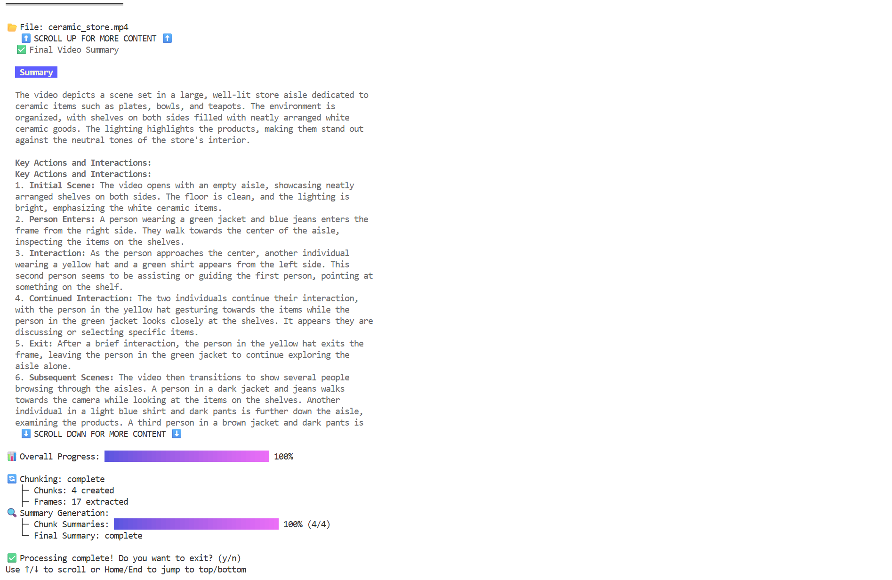

# Video Analysis & Summarization CLI

This CLI tool provides a terminal-based-ui interface to connect to video summarization sample application. The tool helps in uploading videos, tracking analysis and summarization progress, and displaying results.

## Features

- Fully automated: uses YAML configuration for all parameters (no interactive prompts)
- Configure chunk duration, sampling frame, and advanced parameters via YAML
- Track analysis and summarization progress in real time
- Display chunk-level and final video summaries in Markdown
- Save logs and summaries to disk automatically
- Content view with keyboard navigation
- Progress bar visualization

## CLI Application

### Overview

This CLI is a real-time terminal UI for video analysis and summarization. All parameters (video path, chunk duration, prompts, etc.) are read from a YAML config file. The CLI automatically uploads the video, tracks progress, and displays results.


> CLI Screenshot running generic usecase yaml. 

## Project Structure

```
cli/
├── src/              # Source code directory
│   ├── main.go       # Main CLI application entry point
│   ├── config.go     # Configuration structures and models
│   ├── summary.go    # Summary pipeline API functions
│   └── video.go      # Video upload API functions
├── config/           # Configuration files for different use cases
│   ├── generic.yaml  # Default configuration template
│   ├── retail.yaml   # Retail-specific video analysis
│   └── traffic.yaml  # Traffic monitoring and analysis
├── resources/        # Sample resources
├── logs/            # Application logs (auto-created)
├── runs/            # Output files (auto-created)
├── Makefile         # Build automation
├── go.mod           # Go module definition
├── go.sum           # Go module checksums
└── README.md        # This file
└── CONFIGURATION.md # Configuration documentation
```

## Prerequisites

- **Go 1.23.0 or later**: The CLI requires Go version 1.23.0 or higher to build and run
  - Download and install from: https://golang.org/dl/
  - Verify installation: `go version`
  - The Makefile will automatically check for the correct Go version before building

## Build Steps

- **Check Go Version**: Ensure you have Go 1.23.0 or later installed
```bash
# Check if Go version meets requirements
make check-go-version
```

- Install the dependencies using the below command

```bash
# From CLI directory
make deps

```
- Run the below command to build the CLI.

```bash
make build
```

## Usage

1. Configure the backend endpoint and video file in your YAML config file (e.g., `./config/generic.yaml`):
   ```yaml
   backendEndpoint: "http://your-backend-endpoint:port"
   videoPath: "/path/to/your/video.mp4"
   ```

2. Run the CLI in one of the following ways:
   
   - With default config:
     ```
     ./video-summarizer-cli
     ```
   
   - With video path specified via flag (overrides config):
     ```
     ./video-summarizer-cli --video=/path/to/your/video.mp4
     ```
   
   - With a specific use case config (retail analysis):
     ```
     ./video-summarizer-cli --config=./config/retail.yaml
     ```
   
   - With traffic monitoring config:
     ```
     ./video-summarizer-cli --config=./config/traffic.yaml
     ```
   
   - With your custom config file:
     ```
     ./video-summarizer-cli --config=./config/my-custom-config.yaml
     ```

3. The CLI will automatically:
   - Upload the video
   - Start the summarization pipeline
   - Track progress in real-time
   - Display chunk summaries as they complete
   - Show the final summary when done
   - Save logs and summaries to the `runs/` directory

## Keyboard Controls

The CLI supports the following keyboard shortcuts:

- `↑/↓`: Scroll content up/down
- `q`: Quit the application

## Configuration

The YAML configuration file (default: `./config/generic.yaml`) contains the following options:

```yaml
chunkDuration: 20            # Duration of each video chunk in seconds
samplingFrame: 5             # Frame sampling interval
overlapOverride: 0           # Frame overlap between chunks
# Multi-frame window is automatically set to samplingFrame + overlapOverride
framePromptOverride: "Describe the scene in detail"  # Prompt for frame analysis
mapPromptOverride: "Summarize these frame descriptions"  # Prompt for map phase
reducePromptOverride: "Create a cohesive summary from these chunks"  # Prompt for reduce phase
singlePromptOverride: "Create a concise video summary"  # Prompt for single summary
ingestionPipelineOverride: "object_detection"  # Video Ingestion pipeline to use
audioModelOverride: "base.en"  # Audio model to use
videoPath: "/path/to/video.mp4"  # Path to the video file
debug: true                  # Enable debug logging
backendEndpoint: "http://your-backend-endpoint:port"  # Backend API endpoint
```

## Creating Custom Configurations

The CLI supports custom YAML configuration files for different video summarization use cases. You can create specialized configurations for:

- **Retail Analytics**: Product demonstrations, customer behavior analysis
- **Traffic Monitoring**: Vehicle counting, incident detection, flow analysis  
- **Security Surveillance**: Event detection, anomaly identification
- **Educational Content**: Lecture summarization, tutorial breakdown
- **Marketing Videos**: Campaign analysis, engagement tracking

To create a custom configuration:

1. Copy an existing config file as a template:
   ```bash
   cp ./config/generic.yaml ./config/my-usecase.yaml
   ```

2. Customize the prompts and parameters for your specific use case.

3. Use your custom configuration:
   ```bash
   ./video-summarizer-cli --config=./config/my-usecase.yaml
   ```

> NOTE : For more details on the configuration parameters, please refer to the [Configuration Documentation](./CONFIGURATION.md).

## Output Files

The CLI automatically saves the following files:

1. **Log files**: Detailed application logs in `./logs/cli_TIMESTAMP.log`
2. **JSON data**: Complete API response data in `./runs/CONFIG_TIMESTAMP.json`
3. **Markdown summary**: Formatted summary in `./runs/CONFIG_TIMESTAMP.md`

## Known Issues

- **Real-time scrolling**: Scrolling with `↑/↓` may feel jumpy when new summaries arrive from the backend. Use saved outputs in `runs/` to review completed content, or wait for processing to complete before scrolling.

- **Minimal input validation**: The CLI performs basic validation of YAML configs and backend responses. Invalid values may cause unexpected behavior. Use example configs in `config/` as templates and verify your backend supports the specified options via `/manager/app/config`.

For issues not covered here, capture logs from `logs/` and report them with your config file to help reproduce and prioritize fixes.