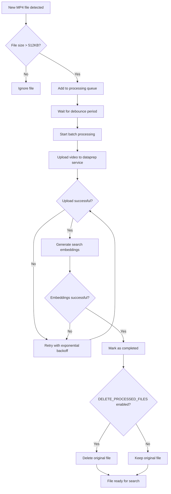

# 📁 Directory Watcher Service Guide

## Overview

The Directory Watcher service is an automated video ingestion system that monitors a specified directory for new video files and automatically processes them for search indexing. This service is designed to work exclusively with the **Video Search** mode of the application.

## How It Works

The Directory Watcher service provides the following functionality:

### 🔍 File Monitoring

- **Watches for MP4 files**: Monitors a specified directory for new `.mp4` video files
- **File size filtering**: Only processes files larger than 512KB (524,288 bytes) to avoid incomplete or corrupted files
- **Real-time detection**: Automatically detects when files are created or modified in the watched directory
- **Recursive monitoring**: Optionally monitors subdirectories when `VS_WATCH_DIRECTORY_RECURSIVE=true` is set

### ⏱️ Debounced Processing

- **Debounce mechanism**: Groups file events together to avoid processing files multiple times during rapid file operations
- **Configurable delay**: Uses a configurable debounce time (default: 5 seconds) before processing detected files
- **Batch processing**: Processes multiple files together for efficiency

### 🚀 Automatic Upload and Indexing

- **Two-step process**:
  1. Uploads video files to the data preparation service
  2. Generates search embeddings for the uploaded videos
- **Retry mechanism**: Implements exponential backoff retry logic (up to 3 attempts) for failed uploads
- **Status tracking**: Maintains upload status with total, completed, and pending file counts

### 🗂️ Initial Directory Processing

- **Bulk upload**: Optionally processes all existing MP4 files in the watched directory on startup
- **Batch processing**: Processes existing files in batches of 10 for optimal performance
- **Thread-based**: Uses separate threads for non-blocking batch uploads

## Configuration

The Directory Watcher service is configured through environment variables. The service is automatically enabled.

### Optional Configuration (Override Default Values)

The following environment variables have default values and only need to be set if you want to override them:

```bash

# Path to the directory to watch on the host system (enables directory watcher)
# Default: "edge-ai-libraries/sample-applications/video-search-and-summarization/data"
export VS_WATCHER_DIR="/path/to/your/video/directory"

# Time to wait before processing detected files (in seconds)
# Default: 10
export DEBOUNCE_TIME=10

# Process all existing files in the `VS_WATCHER_DIR` directory on startup
# Default: false
export VS_INITIAL_DUMP=true

# Delete processed files from `VS_WATCHER_DIR` after successful upload
# Default: false
export DELETE_PROCESSED_FILES=true

# Enable recursive monitoring of subdirectories
# Default: false
export VS_WATCH_DIRECTORY_RECURSIVE=true
```

> **Note**: You only need to export these variables if you want to change the default behavior. The service works with default values when only `WATCH_DIRECTORY_HOST_PATH` is set.

## Usage Instructions

### Setting Up Directory Watching

1. **Optional: Create a directory** on your host system to store video files:

> **Note:** Make sure that the directory is created with normal user access and not as the root user.

   ```bash
   mkdir -p /home/user/videos
   ```

2. **Optional: Set the required environment variable**:

   ```bash
   export VS_WATCHER_DIR="/home/user/videos"
   ```

3. **Optional: Override default settings** if needed:

   ```bash
   # Only set these if you want to change default behavior
   export VS_INITIAL_DUMP=true              # Process existing files on startup
   export DELETE_PROCESSED_FILES=true       # Remove files after processing
   export DEBOUNCE_TIME=15                  # Wait 15 seconds instead of default 10
   export VS_WATCH_DIRECTORY_RECURSIVE=true    # Monitor subdirectories recursively
   ```

4. **Start the application** with directory watching enabled:

   ```bash
   source setup.sh --search
   ```

### Adding Videos for Processing

Once the service is running, simply copy or move MP4 files to your watched directory:

```bash
# Copy videos to the watched directory
cp /path/to/your/videos/*.mp4 /home/user/videos/

# Or move videos
mv /path/to/source/*.mp4 /home/user/videos/

# If recursive monitoring is enabled, you can also organize videos in subdirectories
mkdir -p /home/user/videos/category1 /home/user/videos/category2
cp /path/to/category1/*.mp4 /home/user/videos/category1/
cp /path/to/category2/*.mp4 /home/user/videos/category2/
```

The service will automatically:

1. Detect the new files
2. Wait for the debounce period to ensure file operations are complete
3. Upload and process the videos for search indexing
4. Make them available for search queries through the application UI

### Monitoring Upload Status

The Directory Watcher provides upload status information that can be monitored through the application logs:

- **Total files**: Total number of files detected for processing
- **Completed files**: Number of successfully processed files  
- **Pending files**: Number of files waiting to be processed
- **Last updated timestamp**: When the last file processing operation completed

## File Processing Flow



## Best Practices

### File Management

- **Use descriptive filenames**: This helps with identification and debugging
- **Ensure sufficient disk space**: Both for incoming files and potential processing overhead
- **Consider file cleanup**: Enable `DELETE_PROCESSED_FILES=true` if you don't need to keep original files

### Performance Optimization

- **Adjust debounce time**: Increase `DEBOUNCE_TIME` if you frequently add multiple files simultaneously
- **Monitor system resources**: Large video files require significant processing power and memory
- **Batch file additions**: Add multiple files at once rather than one-by-one for better efficiency

### Monitoring and Troubleshooting

- **Check application logs** for upload status and error messages
- **Verify directory permissions**: Ensure the application has read access to the watched directory
- **Confirm network connectivity**: Ensure the video upload endpoint is accessible
- **Monitor disk space**: Processing requires temporary storage for video analysis

## Limitations

- **MP4 files only**: Currently supports only MP4 video format
- **Search mode only**: Directory watching is not available in summary or combined modes
- **File size minimum**: Files must be larger than 512KB to be processed
- **Local directory only**: Watches local filesystem directories, not remote or cloud storage
- **Subdirectory monitoring**: By default, only monitors the specified directory. Enable recursive monitoring with `VS_WATCH_DIRECTORY_RECURSIVE=true` to include subdirectories

## Troubleshooting

### Common Issues

**Files not being processed**:

- Verify `WATCH_DIRECTORY_HOST_PATH` is set and points to an accessible directory
- Check that files are MP4 format and larger than 512KB
- Ensure the watched directory path is correct and accessible
- Review application logs for error messages

**Upload failures**:

- Check network connectivity and proxy settings
- Review retry attempts in the logs
- Ensure the data preparation service is running

**Permission errors**:

- Verify read permissions on the watched directory
- Check that the container has appropriate file system access
- Ensure the directory exists and is mounted correctly

**High resource usage**:

- Reduce the number of simultaneous file additions
- Increase `DEBOUNCE_TIME` to reduce processing frequency
- Monitor system memory and CPU usage during processing

For additional troubleshooting, refer to the application logs and the main [troubleshooting section](./get-started.md#troubleshooting) of the getting started guide.
