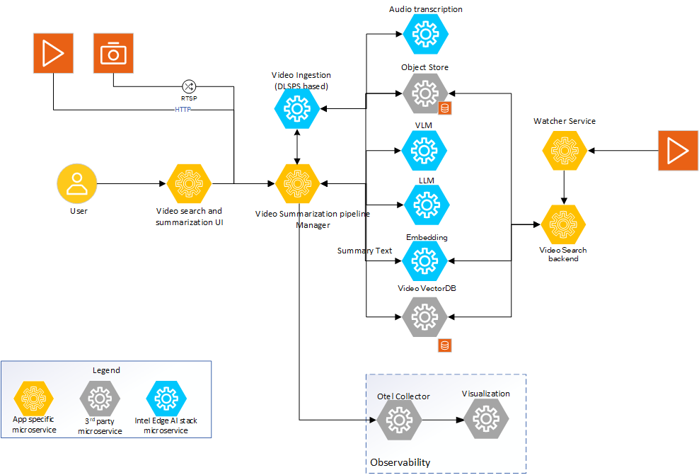

# Video Search and Summarization Architecture Overview

The page provides a technical overview of the Video Search and Summarization application combined mode architecture, components, and extensibility. The documentation builds on top of the documentation of Video Search and Summarization capability in individual mode and highlights how the components are reused to realize the combined mode.

## Approach
The system architecture diagram shows the Video Search and Summarization pipeline and its constituent components. All the components across Video Search and Video Summarization is used to realize the combined mode. The following is a high-level overview of the components.

1. **Video Search and Summarization UI**: A reference UI is provided for users to interact with and exercise all capabilities of the Video Search and Summarization application, including video upload, search queries, and summary viewing.

2. **Video pipeline manager**: The pipeline manager is the central orchestrator of both Video Search and Video Summarization pipelines. It receives requests from the UI and coordinates the microservices to deliver unified Video Search and Summarization capabilities. It provides asynchronous handling of video processing while simultaneously creating embeddings for search indexing.

3. **Video Ingestion**: This microservice is responsible for ingesting videos that need to be both summarized and indexed for search. The ingestion microservice is based on Intel DLStreamer pipeline and utilises the DLStreamer pipeline server (DLSPS) to manage the video pipeline. The video ingestion microservice allows ingestion of common video formats. The ingestion microservice creates video chunks, extracts configured frames from it, passes the frame(s) through object detection and outputs all of the metadata and the video chunks to the object store.

4. **Multimodal Embedding Generation**: The embedding microservice generates vector representations of video content - frames summary, captions summary, and audio transcriptions. The vector representations enables the semantic search capabilities. These embeddings are created in parallel with the summary generation process and stored in a vector database for efficient retrieval.

5. **VLM as the captioning block**: The VLM microservice is responsible for generating captions for the specific video chunk. The VLM accepts prompts which also includes additional information from configured capabilities (like object detection) and generates the caption. The caption information is stored to the object store and also used for embedding generation.

6. **LLM as the summarizer of captions**: The LLM microservice is used to generate the summary of the individual captions. It is configurable if to use LLM or the VLM to generate such summaries.

7. **Audio transcription**: The Audio transcription microservice helps create a transcription of the audio channel in the given video. The extracted audio transcription serves as another source of rich metadata that can be used both as an input to VLM and separately as text data to enrich the Video Search and Summarization capabilities.

8. **Vector Database and Search**: A vector database stores the multimodal embeddings and enables fast semantic search across the video collection. Users can search for videos using natural language queries that are matched against video content semantically.

*Figure 1: Architecture of Video Search and Summarization sample application

Further details on the system architecture and customizable options are available [here](./overview-architecture-summary.md).

Note: In the figure, though Reranker is shown, the support for the same is a function of the VectorDB used. The default VSS pipeline uses VDMS VectorDB. Support for Reranker is not available with this VectorDB.

## Detailed Architecture
<!--
**User Stories Addressed**:
- **US-7: Understanding the Architecture**
  - **As a developer**, I want to understand the architecture and components of the application, so that I can identify customization or integration points.

**Acceptance Criteria**:
1. An architectural diagram with labeled components.
2. Descriptions of each component and their roles.
3. How components interact and support extensibility.
-->

Video Search and Summarization application is a unified pipeline that provides both semantic search and summarization capabilities to meet different deployment requirements. The capabilities ensure a rich contextual and perceptual analysis of video during both the search indexing and summarization process, thereby providing qualitatively richer search results and summaries of the given video collection. The figures below illustrate the setup. The Video Search and Summarization UI communicates with the pipeline manager microservice to upload videos for processing, perform semantic searches across the video collection, and view summaries. The UI allows users to configure the specific capabilities required in both Video Search and Summarization pipelines. The pipeline manager is responsible for managing user requests and dynamically configuring functional pipelines for both search indexing and summarization.

The VLM, LLM, and Embedding microservices are provided as part of Intel's Edge AI inference microservices catalog supporting a rich set of open-source models that can be downloaded from popular model hubs like [Hugging Face OpenVINO](https://huggingface.co/OpenVINO). The video ingestion microservice provides capability to ingest common video formats, chunk the video, feed the extracted frames to configurable capabilities like object detection, and provide the output to both the VLM microservice for captioning and the embedding microservice for search indexing. The individual captions are then summarized by the LLM microservice to provide the final summary, while simultaneously being converted to embeddings and stored in a vector database for semantic search. The audio transcription microservice provides ability to transcribe the audio using Whisper model, contributing to both summary generation and search capabilities. An object store is used to save the raw videos, frames, and generated metadata, while a vector database stores the embeddings for fast semantic search.

### Architecture Diagram

*Figure 2: Microservices used in Video Search and Summarization sample application

### Application Flow
The application flow involves the following steps for both search indexing and summarization:

1. **Create the Video Search and Summarization pipeline**
   - **Configure the pipeline**: The _Video Search and Summarization UI microservice_ provides the user a means to configure the different capabilities required on both Video Search and Video Summarization pipelines. A separate user guide is planned to provide all required details on how to setup the pipeline.
   - **Create the pipeline**: The configuration done on the UI is received by the _Video Search and Summarization pipeline manager microservice_. The pipeline manager configures the required microservices as per the capabilities and configuration requested by the user.
2. **Input Video Sources**:
   - **Provide video**: The user provides the source of the video to be processed for both search indexing and summarization. The UI provides means to configure the input video. Currently, only offline video processing is supported by reading from local storage. In future, live camera streaming support will also be provided. The pipeline manager stores the video into a local object store.
   - **Ingest video**: The stored video is then consumed by the _video ingestion microservice_. The video ingestion microservice reuses DL Streamer pipeline server and all its capabilities to provide for different features like object detection, audio classification, and (in future) input feed from live cameras. The ingestion process involves decode, chunking, and selection of frame(s) from the input video. The extracted frame(s) is passed through object detection blocks, audio classification block if they are configured. The extracted frames along with the metadata returned by the object detector and/or audio classification is then passed to both the VLM microservice for captioning and the embedding microservice for search indexing.
   - **Audio transcription**: The video is demuxed and audio extracted for transcription. Using the object store, the audio is fed to the _Audio transcription microservice_ and transcription is created. This transcription is used to feed to both the caption generation process and embedding creation for search, as well as stored in the object store for later stage processing.
3. **Create Caption for given frame(s) and Generate Embeddings**
   - **VLM microservice**: The extracted frame(s) along with the prompt and metadata returned from the object detector and/or audio classification is passed to the _vlm-ov-serving_ for captioning. Depending on the configuration and compute availability, batch captioning is also supported. To optimize for performance, the captioning is done in parallel with the video ingestion.
   - **Embedding generation**: Simultaneously,  generated captions and metadata are processed by the _multimodal embedding microservice_ to create vector representations that enable semantic search. These embeddings are stored in a vector database and indexed for fast retrieval.
   - **VLM model selection**: The capability of the VLM microservice is dependent on the VLM model used. Example, multi-frame caption by maintaining a context between frames is a function of the chosen model. In addition, the prompt passed has a significant implication on the quality of the output of the VLM.
   - **Store the captions and embeddings**: The generated captions along with all the metadata generated in the pipeline is stored in a local object store. During store, necessary relationship information between the stored data is also maintained. Concurrently, the embeddings are stored in the vector database with proper indexing for search functionality.
4. **Create a summary of all captions**:
   - **LLM microservice**: After all the captions are generated, the _LLM microservice_ is used to create a summary of all individual captions. The selection of LLM model has an impact on the accuracy of the summary created.
5. **Enable semantic search capabilities**:
   - **Search functionality**: Once embeddings are created and stored, users can perform semantic searches across the entire video collection using natural language queries. The search system matches user queries against the stored embeddings to find semantically similar video content.
   - **Unified interface**: The UI provides both summary viewing and search capabilities, allowing users to discover relevant videos through search and then view their summaries.
6. **Observability dashboard**:
   - If set up, the dashboard displays real-time logs, metrics, and traces providing a view of the performance, accuracy, and resource consumption by the application..

<!-- The application flow is illustrated in the following flow diagram. The diagram shows the API used and the data sharing protocol for both Video Search and Video Summarization capabilities.

*Figure 3: Dataflow for Video Search and Summarization sample application
-->

## Key Components and Their Roles
<!--
**Guidelines**:
- Provide a short description for each major component.
- Explain how it contributes to the application and its benefits.
-->
The key components of Video Search and Summarization sample application are as follows:

1. **Intel's Edge AI Inference microservices**:
   - **What it is**: Inference microservices are the VLM, LLM, Audio transcription, and Multimodal Embedding microservices that run the chosen models optimally on the hardware.
   - **How it's used**: Each of the microservices uses OpenAI APIs to support their functionality. The microservices are configured to use the required models and launched. The video pipeline manager accesses these microservices using the APIs for both summary generation and search indexing.
   - **Benefits**: The default configuration of these microservices as provided by the sample application is guaranteed to perform optimally for the chosen models and on the target deployment hardware. Standard OpenAI API ensures easy portability of different inference microservices.

2. **Video ingestion microservice**:
   - **What it is**: Video ingestion microservice, which reuses DL Streamer pipeline server, provides capability to ingest videos, extract audio, create chunks, provides object detection and audio classification capabilities, and feed all the extracted raw information and generated metadata to both Video Search and Video Summarization indexing stages of processing.
   - **How it's used**: Video ingestion microservice provides a REST API endpoint that can be used to manage the contents. The Video pipeline manager uses this API to access its capabilities for both summary generation and embedding creation.
   - **Benefits**: DLStreamer pipeline server is a standard Intel offering which is optimized for various media and vision analytics based inference tasks. Refer to DLStreamer pipeline server documentation for details on its capabilities.

3. **Video Summarization Pipeline manager microservice**:
   - **What it is**: This microservice is the heart of the video summarization sample application because it orchestrates the pipeline as per user configuration. The pipeline manager uses a message bus to coordinate across different microservices and also provides performance-motivated capabilities like batching and parallel handling of multiple operations.
   - **How it’s used**: A REST API endpoint is provided which is used by the UI front end to send user queries and trigger the summarization pipeline.
   - **Benefits**: The microservice provides a reference of how the different microservices have to be orchestrated for video summarization pipeline.

4. **Video Summarization UI microservices**:
   - **What it is**: The UI microservice allows the user to interact with the sample application. It allows the user to configure the capabilities required on the summarization pipeline, configure the input video details, and trigger the summarization pipeline.
   - **How it’s used**: UI interface should be used by the user to interact with this microservice.
   - **Benefits**: This microservice should be treated as a sample reference implementation.

5. **Dependent microservices**:
   The dependent microservices are those that are used by the pipeline to realize both Video Search and Video Summarization features. Few of them are inference microservices while the others are data handling microservices. These microservices belong to either (1) or (2) listed above. The dependent microservices are:
   - [Multimodal Embedding](../../../../microservices/multimodal-embedding-serving/) - Creates vector embeddings for semantic search
   - [Audio Analyzer](../../../../microservices/audio-analyzer/) - Provides audio transcription capabilities
   - [VDMS based data preparation](../../../../microservices/visual-data-preparation-for-retrieval/vdms/) - Handles vector database storage and retrieval
   - [VLM microservice](../../../../microservices/vlm-openvino-serving/) - Generates captions for video content
   - [Vector Retriever](../../../../microservices/vector-retriever/) - Enables semantic search across the video collection

   Refer to their respective documentation for details on their capability.

## Extensibility

The Video Search and Summarization sample application is designed with modularity in mind, allowing you to:
1. **Change inference microservices**:
   - The default option is OVMS. Use other model servers like vLLM with OpenVINO backend, and TGI to host VLM models.
   - Mandatory requirement is OpenAI API compliance. Note that other model servers do not provide the same performance as default options.
2. **Load different VLM, LLM, and Embedding models**:
   - Use different models from Hugging Face OpenVINO model hub or vLLM model hub. The models are passed as a parameter to corresponding model servers.
   - Embedding models can be swapped to optimize for different types of content or search requirements.
3. **Configure different capabilities on both Video Search and Video Summarization pipelines**:
   - In addition to available capabilities, the approach also allows newer capabilities to be enabled if it helps on the accuracy of both search results and summaries.
   - The UI, pipeline manager, and required microservices are easily configurable to allow for such extensions.
4. **Customize vector database and search configurations**:
   - Different vector databases can be integrated (VDMS, Milvus, etc.) based on performance and scalability requirements.
   - Search parameters, similarity thresholds, and indexing strategies can be tuned for optimal search performance.
5. **Deploy on diverse Intel target hardware and deployment scenarios**:
   - Follow the system requirements guidelines on the different options available for both Video Search and Video Summarization workloads.

## Next Steps
- [Get Started](./get-started.md)
