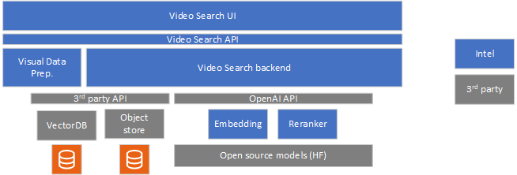
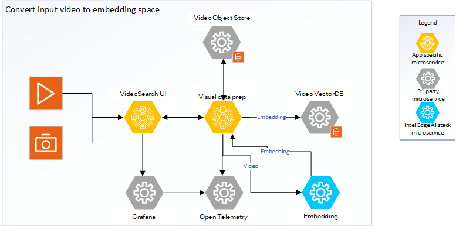
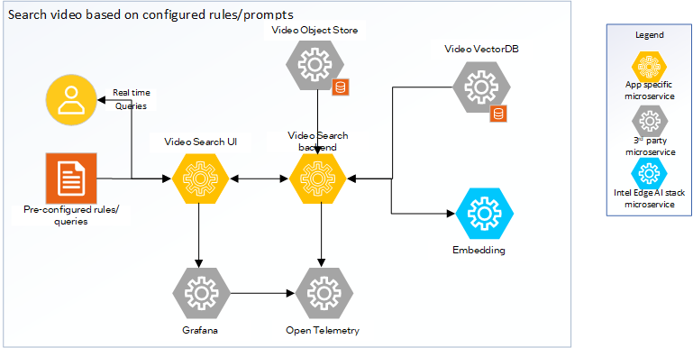
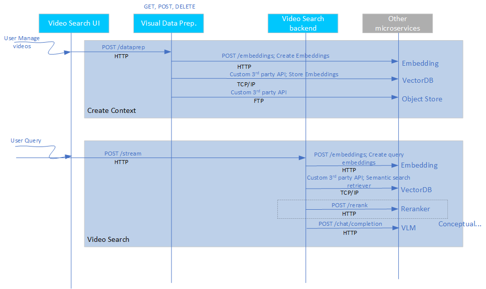

# Video Search Architecture Overview

The Video Search mode allows developers to customize and deploy the sample application in an on-premises environment and on their private video store without compromising on the accuracy of the responses. The application is built on a modular microservices approach using popular [LangChain\* framework](https://www.langchain.com/). This page provides a technical overview of the application’s architecture, components, and extensibility.

## Approach
The Video Search sample application includes the following components:

- **Video Search UI**: Users can use the reference UI to interact with and use capabilities of the Video Search sample application. Queries are raised using the interface. Those queries that need to function in the background not just on current video corpus but all incoming videos can be marked as such in the UI. 

- **Visual Data Prep. microservice**: The sample visual data preparation microservice allows ingestion of video from the object store. The ingestion process creates embeddings of the videos and stores them in the preferred vector database. The modular architecture allows users to customize the vector database. The sample application uses [Visual Data Management System (VDMS)](https://github.com/IntelLabs/vdms) database. The raw videos are stored in the MinIO\* object store, which is also customizable.

- **Video Search backend microservice**: The Video Search backend microservice handles the queries from the users. The backend microservice is responsible for embedding the search query and generating the response based on the search result. The VectorDB is queried for the best match in the embedding space.

- **Embedding inference microservice**: The OpenVINO™ based microservice runs embedding models efficiently on the target Intel hardware.

- **Reranking inference microservice**: Though an option, the reranker is currently not used in the pipeline. OpenVINO™ model server runs the reranker models. \
Note: In the figure, though Reranker is shown, the support for the same is a function of the VectorDB used. The default VSS pipeline uses VDMS VectorDB. Support for Reranker is not available with this VectorDB.

See details on the system architecture and customizable options [here](./overview-architecture-search.md).

## Detailed Architecture Overview
<!--
**User Stories Addressed**:
- **US-7: Understanding the Architecture**  
  - **As a developer**, I want to understand the architecture and components of the application, so that I can identify customization or integration points.

**Acceptance Criteria**:
1. An architectural diagram with labeled components.
2. Descriptions of each component and their roles.
3. How components interact and support extensibility.
-->

Video Search pipeline is a combination of the core LangChain application logic that implements the Video Search pipeline and the set of microservices that implements the salient blocks of the Video Search pipeline. The following figures illustrate the setup. The Video Search UI communicates with the Video Search backend microservice. The Embedding microservice is provided as part of Intel's Edge AI inference microservices catalog supporting a rich set of open-source models that can be downloaded from popular model hubs. For example, the [Hugging Face OpenVINO toolkit](https://huggingface.co/OpenVINO), a model from Hugging Face\* Model Hub that has been optimized using Intel's OpenVINO™ toolkit. The visual data prep. microservice can ingest common video formats, convert it into embedding space, and store it in the vector database. You can also save a copy of the video to the object store.

### Technical Architecture Diagram

*Figure 1: Architecture of video ingestion process

*Figure 2: Architecture of video query process

### Application Flow
1. **Input Sources**:
   - **Videos**: The visual data prep. microservice supports ingesting from common video formats. Currently, the ingestion supports ingesting video only from video files. Support for live streaming input is not provided yet.
   
2. **Create the context**

   - **Upload input videos**: The UI microservice allows the developer to interact with the application through the defined application API. The UI microservice provides the interface to upload the videos on which the search pipeline will be executed. The videos are uploaded and stored in object store. The application stores videos in the MinIO\* database. The ingestion of videos can be done on a continuous basis from pre-configured folder locations. This allows for deployment of the pipeline in live surveillance kind of scenarios.
   
   - **Convert to embeddings space**: The Video ingestion microservice creates the embeddings from the uploaded videos using the embedded microservice. The applicaion stores the embeddings in a vector database. The sample application uses VDMS.
   
3. **Query flow**

   - **Ask a query**: The UI microservice provides a prompt window for user queries. The queries can be saved for any future reference and usage. It is possible to enable up to 8 queries to run in the background continuously on any new video being ingested. This is a critical capability required in using this pipeline for agentic reasoning.
   
   - **Execute the Video Search pipeline**: The Video Search backend microservice does the following to generate the output response using the Video Search pipeline:
      - Converts the query into an embedding space using the Embeddings microservice.
	  
      - Does a semantic retrieval to fetch the relevant videos from the vector database. Currently, the top-k (with k being configurable) video is used. Does not use a reranker microservice currently.
	  
4. **Output Generation**:
   - **Response**: Sends the search results including the retrieved video from object store to the UI for display and use.
   
   - **Observability dashboard**: If set up, the dashboard displays real-time logs, metrics, and traces providing a view of the performance, accuracy, and resource consumption by the application.  

The following figure shows the application flow, including the APIs and data sharing protocols:

*Figure 3: Data flow for Video Search sample application

## Key Components and Their Roles
<!--
**Guidelines**:
- Provide a short description for each major component.
- Explain how it contributes to the application and its benefits.
-->

1. **Intel's Edge AI Inference microservices**:
   - **What it is**: Inference microservices are the embeddings and reranker microservices that run the chosen models on the hardware, optimally. 
   - **How it is used**: Each microservice uses OpenAI\* APIs to support their functionality. The microservices are configured to use the required models and are ready. The Video Search backend accesses these microservices in the LangChain\* application which creates a chain out of these microservices.
   - **Benefits**: Intel guarantees that the sample application's default microservices configuration is optimal for the chosen models and the target deployment hardware. Standard OpenAI APIs ensure easy portability of different inference microservices.

2. **Visual Data Prep. microservice**:
   - **What it is**: This microservice can ingest contents from videos, create the necessary context, and retrieve the right context based on user query.
   - **How it is used**: Video ingestion microservice provides a REST API endpoint that can be used to manage the contents. The Video Search backend uses this API to access its capabilities.
   - **Benefits**: The core part of the video ingestion functionality is the vector handling capability that is optimized for the target deployment hardware. You can select the vector database based on performance considerations. The implementation can be treated as a reference implementation.

3. **Video Search backend microservice**:
   - **What it is**: Video Search backend microservice is a LangChain framework-based implementation of Video Search's RAG pipeline, which handles user queries.
   - **How it is used**: The UI frontend uses a REST API endpoint to send user queries and trigger the Video Search pipeline.
   - **Benefits**: The microservice provides a reference on using the LangChain framework for implementing Video Search through Intel's Edge AI inference microservices.

4. **Video Search UI**:
   - **What it is**: A reference frontend providing an interface for you to interact with the Video Search pipeline.
   - **How it is used**: The UI microservice runs on the deployed platform on a certain configured port. Accessing the specific URL allows you to use the UI.
   - **Benefits**: This microservice must be treated as a sample reference implementation.

## Extensibility

Intel designed the Video Search sample application with modularity, allowing developers to:

1. **Change inference microservices**:

   - The default option is OpenVINO model server. It is possible to use other model servers like Virtual Large Language Model (vLLM) with OpenVINO as backend and Text Generation Inference (TGI) to host Embedding and Vision-Language Models (VLMs) too though the options have not been validated.
   - The mandatory requirement is OpenAI API compliance. Note that Intel does not guarantee that other model servers can provide the same performance compared to the default options.
   
2. **Load different Embedding, and reranker models**:

   - Use different models from Hugging Face OpenVINO Toolkit or vLLM model hub. The models are passed as a parameter to corresponding model servers.
   
3. **Use other generative AI frameworks like Haystack\* framework and LlamaIndex\* tool**:

   - Integrate the inference microservices into an application backend developed on other frameworks similar to the LangChain framework integration provided in this sample application.
   
4. **Deploy on diverse target Intel® hardware and deployment scenarios**:

   - Follow the system requirements guidelines on the different options available.

## Next Steps
- [Get Started](./get-started.md)
