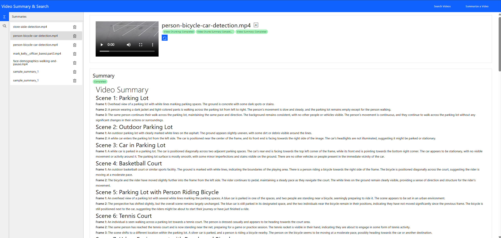

# Video Search and Summarization Overview

Video Search and Summarization pipeline creates a summary of a collection of long-form videos, and enables semantic search over the generated summary of the collection. It combines Generative AI Vision Language Models (VLMs) and multimodal embedding models to understand and extract requested content from videos. This unified approach enables efficient content review, improved searchability, and intelligent video discovery within large video collections.

The video search is executed over the generated summary. The search result is used to determine the relevant parts of the video(s) to be returned as response to the user query. The application demonstrates how to create a comprehensive video understanding experience using a cost efficient portfolio of Intel AI systems and using Intel's Edge AI microservices catalog. It makes it easy to develop, customize, and deploy Video Search and Summarization solutions in diverse deployment scenarios with out-of-the-box support for on-premise and edge environments.

## Purpose

Combining video search and video summarization unlocks a wide range of practical use cases across industries where rapid access to relevant video content is essential. A few examples are provided below.
- Security and surveillance teams benefit from semantic search capabilities to efficiently identify incidents, suspicious activities, or patterns across hours of footage, improving response times and situational awareness.
- In education and training, instructors and learners can retrieve key moments or topics from recorded lectures and tutorials, enhancing knowledge discovery and personalized learning.
- Legal and compliance professionals can use search to pinpoint evidence or verify claims within video records, supporting investigations and audits.
- In media and entertainment, editors and analysts can quickly locate and review specific scenes or events within large archives, streamlining content production and compliance checks.

Additionally, enterprises managing video libraries for marketing, customer support, or product documentation can leverage Video Search and Summarization application to organize, index, and retrieve valuable content, driving productivity and informed decision-making.

The combined mode serves as a proof point of the capabilities of Intel's Edge AI systems portfolio to run complex use cases. The sample application runs in its fullest configuration in the combined mode thereby showcasing a resource intensive usage. The users can customize the application on multiple levels including model configuration and use it to size the application. The sizing runs allows to select the right hardware configuration to run the combined mode.

## Key Features

The combined mode in the Video Search and Summarization application delivers a powerful workflow by integrating both summarization and semantic search capabilities. In this mode, the system first generates a concise, context-rich summary of each long-form video using advanced GenAI Vision Language Models (VLMs) and multimodal embedding models. This summary text is then converted into embeddings, enabling highly efficient and accurate semantic search directly over the distilled content rather than the entire video corpus.

Key features of the combined mode include:

- **Summary-Driven Semantic Search**: Enables search over the generated summaries, allowing users to find relevant content quickly and precisely by querying the most important information extracted from each video.
- **Efficient Indexing and Retrieval**: Reduces the computational and storage overhead by indexing compact summary embeddings instead of full-length video or frame-level embeddings, resulting in faster search and lower resource usage.
- **Contextual Relevance**: Improves search quality by leveraging summaries that capture the core context and key events of each video, minimizing irrelevant results and reducing hallucinations.
- **Unified Pipeline Orchestration**: Seamlessly integrates summarization and search microservices, automating the workflow from video ingestion to summary generation, embedding creation, and semantic search.
- **Customizable Summary Generation**: Allows configuration of summary granularity and focus, enabling tailored summaries for different use cases or domains before embedding and indexing.
- **Scalable Architecture**: Supports large video collections by streamlining the search process, making it suitable for enterprise-scale deployments and edge environments.
- **Enhanced User Experience**: Provides concise, relevant search results with direct links to summarized video segments, improving content discovery and review efficiency.

This combined approach maximizes the value of both summarization and search, delivering a robust solution for rapid, accurate, and resource-efficient video understanding across diverse applications. The Video Search and Summarization sample application provides the above listed features through the supported capabilities of the Video Search and Summarization microservices. The reader is adviced to check the documentation of the Video Search mode and Video Summarization mode for a baseline view of the capabilities. Building on top of the capabilities of search mode and summary mode, the combined mode implementation further provides:
- **Natural Language Querying**: The embeddings generated using the generated summary text enables users to search or query video content using natural language queries, making the search process intuitive and user-friendly.
- **Summary to Text indexing**: A rich index is maintained to associate the generated summary with video at a chunk and frame level. This allows for easy retrieval of corresponding videos based on the search results.
- **Reuse of building block microservices**: The inference microservices are reused between the different modes of Video Search and Summarization application. The pipeline manager microservice is reused too. This highlights the design strengths of the microservices offered.
- **Intuitive extension of user interface for combined mode**: The same user interface is also extended to support the combined mode thereby ensuring a consistent experience for the users.

## High level architecture
The combined Video Search and Summarization mode uses all the components of the Video Search and Video Summarization application. The purpose of this sample application is to enable users to create both video summarization and semantic search pipelines with the best possible accuracy for given compute resources. The figure shows the combined mode high level architecture.

The combined sample application:
- Demonstrates how Intel's Edge AI catalog of inference microservices can be used to quickly build Video Search and Summarization pipelines. The inference microservices are optimized for Intel's Edge AI systems.
- Serves as a blueprint for building similar scalable and modular solutions that can be deployed on Intel's Edge AI systems.
- Showcases the competitiveness of Intel's Edge AI systems to address varied deployment scenario requirements (edge to cloud).
- Provides reference sample microservices for capabilities like video ingestion, embedding generation, vector search, and UI front end that reduces the effort to customize the application.

## How to Use the Application Effectively
The Video Search and Summarization pipeline offers features to improve accuracy for complex long-form videos while enabling efficient discovery across video collections. Choosing which features to use involves balancing accuracy and performance for both search and summary capabilities. To use the tool effectively, start by answering the following key questions:
1. What is the complexity of the videos that need to be processed for both search and summarization?
2. What is the accuracy target both the summarization pipeline and search functionality need to achieve as measured by key qualitative metrics like BERT score for summaries and search relevance metrics?
3. What are the available compute resources to run both pipelines?
4. What are the key performance metrics like throughput, latency, and search response time that need to be achieved by the application?
5. What is the expected size of the video collection and search query volume?

Answering these key questions determines the tradeoff between compute and accuracy for both search and summarization functionality. Based on these decisions, the pipeline is configured and customized using various settings in the sample application. Once the pipeline is optimized for accuracy on the specific hardware, the application is ready for deployment. You upload videos to be processed for both summary generation and search indexing, set required parameters like chunk duration and frame count, and submit the request. The application updates the user on progress and provides both the final summary and adds the video to the searchable collection. Users can then perform semantic searches across the processed videos and view summaries of relevant results. The API specification outlines how to access all the application's features.

Detailed hardware and software requirements are available [here](./system-requirements.md).

To get started with the application, please refer to the [Get Started](./get-started.md) page.
